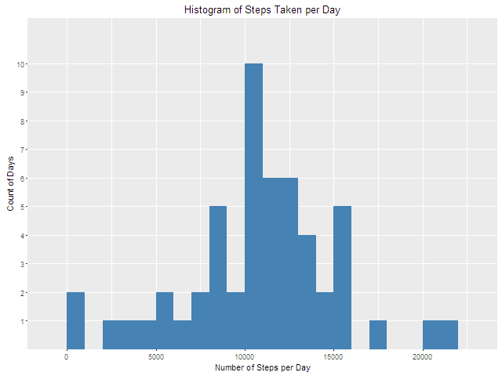
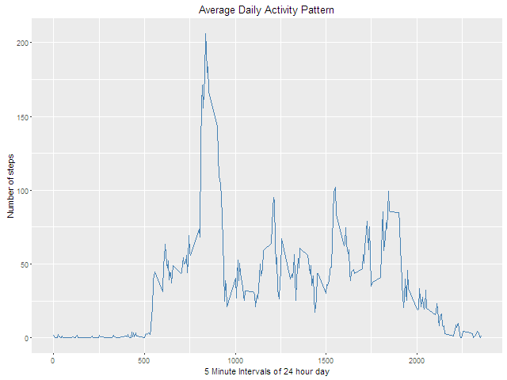
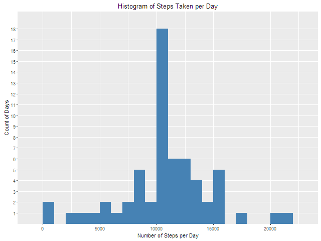
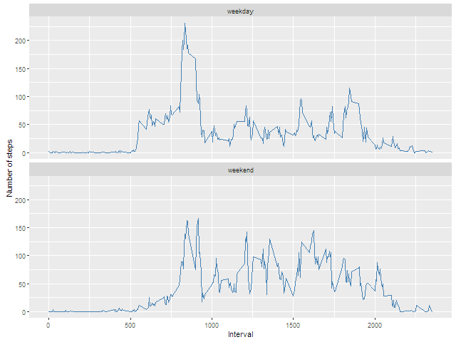

##  Loading and preprocessing the data
#### 1. Unzip and load data
```{r Unzip and load data, echo=TRUE}
if (!file.exists("activity.csv")) {
    unzip('activity.zip')
}
activityData <- read.csv("activity.csv")
```
#### 2. Convert date field to date class
```{r Convert date field to date class, echo=TRUE}
activityData$date <- as.Date(activityData$date, format = "%Y-%m-%d")
```


## What is mean total number of steps taken per day?
#### 1. Calculate mean number of steps taken per day
```{r Calculate mean number of steps per day, echo=TRUE}
stepsPerDay <- aggregate(steps ~ date, activityData, sum)
```
#### 2. Make a histogram of total number of steps taken per day
```{r Build histogram of total number steps take per day, echo=TRUE}
library(ggplot2)
ggplot(stepsPerDay, aes(x = steps)) +
    geom_histogram(fill = "steelblue", binwidth = 1000) +
    scale_y_discrete(breaks = 1:10) +
    ggtitle("Histogram of Steps Taken per Day") +
    xlab("Number of Steps per Day") +
    ylab("Count of Days") +
    theme_gray()
dev.copy(png, "figure/plot1.png", width = 640, height = 480)
dev.off()
```

#### 2. Calculate and report mean and median of total number of steps taken per day
```{r Calculate mean and media of total number of steps per day, echo=TRUE}
cat("Mean steps per day = ", mean(stepsPerDay$steps))
cat("Median steps per day = ", median(stepsPerDay$steps))
```
Mean steps per day =  10766.19  
Median steps per day =  10765  

## What is the average daily activity pattern?
#### 1. Plot average number of steps taken per 5 minute interval across all days
```{r Generate plot, echo=TRUE }
meanStepsPerInt <- aggregate(x = list(meanSteps = activityData$steps), by = list(interval = activityData$interval), FUN = mean, na.rm = TRUE)
ggplot(meanStepsPerInt, aes(x = interval, y = meanSteps)) +   
    geom_line(color = "steelblue") +  
    ggtitle("Average Daily Activity Pattern") +
    xlab("5 Minute Intervals of 24 hour day") +
    ylab("Number of steps") +  
    theme_gray()
dev.copy(png, "figure/plot2.png", width = 640, height = 480)
dev.off()
```

#### 2. Find 5 minute interval with highest average number of steps
```{r 5 Minute interval with highest average number of steps, echo=TRUE}
highInterval <- meanStepsPerInt[which.max(meanStepsPerInt$meanSteps),]
cat("5 minute interval with highest average number of steps = ", highInterval$interval)
```
5 minute interval with highest average number of steps =  835  

## Imputing missing values
#### 1. Calculate and report the total number of missing values in the dataset
```{r Calculate missing values, echo=TRUE}
missingValues <- sum(is.na(activityData$steps))
cat("Total number of missing values = ", missingValues)
```
Total number of missing values =  2304  
#### 2. Create new dataset with missing steps values imputed by mean of 5 minute intervals
```{r Create imputed dataset, echo=TRUE}
imputedActivityData <- activityData 
for (i in 1:nrow(imputedActivityData)) {
    if (is.na(imputedActivityData$steps[i])) {
        imputedActivityData$steps[i] <- meanStepsPerInt[which(imputedActivityData$interval[i] == meanStepsPerInt$interval), ]$meanSteps
    }
}
```
#### 3. Build histogram plot of imputed total number of steps taken each day.
```{r Build histogram plot of total number of steps taken each day, echo=TRUE}
totalStepsPerDay <- aggregate(steps ~ date, imputedActivityData, sum)
ggplot(totalStepsPerDay, aes(x = steps)) +
    geom_histogram(fill = "steelblue", binwidth = 1000) +
    scale_y_discrete(breaks = 1:18) +
    ggtitle("Histogram of Steps Taken per Day") +
    xlab("Number of Steps per Day") +
    ylab("Count of Days") +
    theme_gray()
dev.copy(png, "figure/plot3.png", width = 640, height = 480)
dev.off()
```

#### 4. Calculate and report mean and median of imputed total number of steps taken per day
```{r Calculate mean and media of total number of steps per day, echo=TRUE}
cat("Mean steps per day (imputed) = ", mean(totalStepsPerDay$steps))
cat("Mean steps per day (with NA) = ", mean(stepsPerDay$steps))
cat("Median steps per day (imputed) = ", median(totalStepsPerDay$steps))
cat("Median steps per day (with NA) = ", median(stepsPerDay$steps))
```
Mean steps per day (imputed) =  10766.19  
Mean steps per day (with NA) =  10766.19  
Median steps per day (imputed) =  10766.19  
Median steps per day (with NA) =  10765  

##### a) Do these values differ from the estimates from the first part of the assignment? What is the impact of imputing missing data on the estimates of the total daily number of steps?
These values haven't really changed much. The estimates done earlier in the assignment did not factor in the NAs reported in activityData$steps. Since the NAs were for entire days, this only factored into the count of days reported by the first histogram. The data is nearly the same because the NAs of the activityData are now filled with averages from the activityData$steps for the complete days - this is how we produced imputedActivityData. Therefore, all we have done is give more weight to the averages already defined in the first part of the assignment. That's why the middle band on this last "Histogram of Steps Taken per Day" has a bigger spike than the initial histogram (10 days versus 18 days).  

## Are there differences in activity patterns between weekdays and weekends?
#### 1. Create new factor for "weekend" and "weekday" and append to imputedActivityData
``` {r Create factor for "weekend" and "weekday". Append to imputedActivityData, echo=TRUE}
imputedActivityData$dayofweek <- factor(format(imputedActivityData$date, "%A"))
levels(imputedActivityData$dayofweek) <- list(weekday = c("Monday", "Tuesday",
                                             "Wednesday", "Thursday", "Friday"),
                                 weekend = c("Saturday", "Sunday"))
```
#### 2. Build a panel plot containing a time series plot of the 5-minute interval (x-axis) and the average number of steps taken, averaged across all weekday days or weekend days (y-axis).
```{r Build panel plot showing weekday and weekend average number of steps taken, echo=TRUE}
aveSteps <- aggregate(imputedActivityData$steps, list(interval = as.numeric(as.character(imputedActivityData$interval)), dayofweek = imputedActivityData$dayofweek), FUN = "mean")
names(aveSteps)[3] <- "meanSteps"
ggplot(aveSteps, aes(x=interval, y=meanSteps)) + 
        geom_line(color="steelblue") + 
        facet_wrap(~ dayofweek, nrow=2, ncol=1) +
        xlab("Interval") +
        ylab("Number of steps") +
        theme_gray()
dev.copy(png, "figure/plot4.png", width = 640, height = 480)
dev.off()
```
